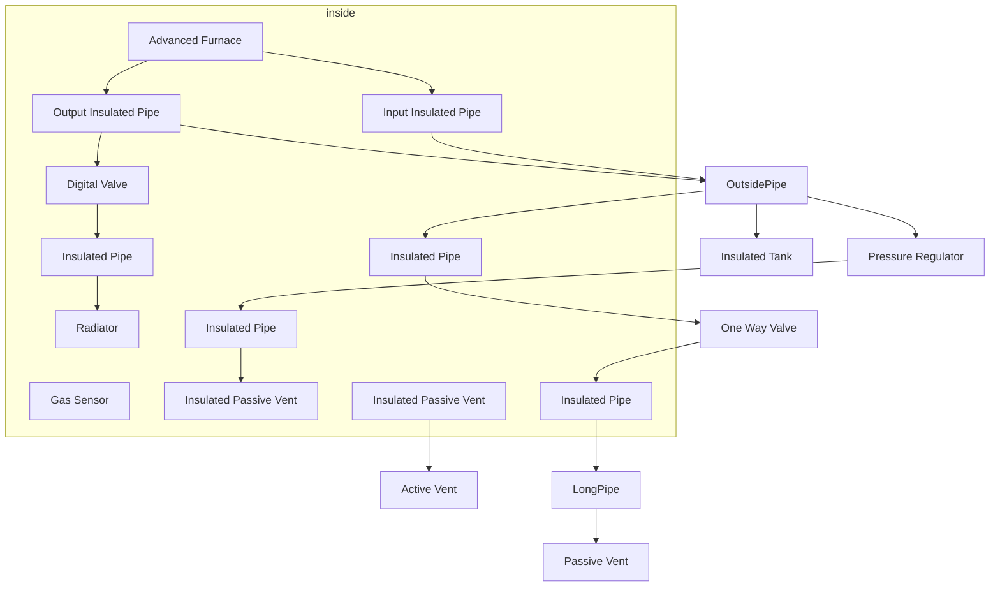

### Advanced Furnace
Build a platform of Steel Frames to 1 level of completion that is 5X5 +1.  Build the shell of a building 3 by 1 surrounding the middle tile with the white walls facing IN.  You need a Roof and Composite Wall floor!  Leave 1 opening in the middle back to build in.  
```
[ ]  EV3 [ ] [ ] [ ] 
[ ]  P  [ ] [ ] [ ] 
[ ]  P   T  [ ] [ ] 
[ ]  P   P   P  [ ] 
    --- --- ---
[ ]| P   F   P |[ ] 
    --- --- ---
[ ] CLS [ ] CLS [ ] 
[ ] [ ] [ ] [ ] [ ] 
```

Place a gas sensor, Passive Vent inside the building, Daylight sensor, Small LED, Gas Temp&Pressure Display Consoles(Label them), Lights, Dial and IC Console on the outside.  Build the piping according to the diagram.  Use Chutes to route the input and output from outside the room into the furnace. Prime the furnace to 900+ temperature. Load the IC10 chip with [This script](IC10/Starter/AdvancedFurnace-RoomControl.ic10). Set the IC Console screws to match the variables in the script.  Turn on the IC Console. Use the LEDs to monitor the tank and continue priming the furnace and exhausting with the output it until the you reach 2MPa in the tank, the temperature should be above 650.  The room should stabilize at a pressure 200kPa, a temperature within 100 of the tank, and the vent and regulator should be off.


*Ingots:  20g Iron, 77g Copper, 41g Gold, 26g Silicon, 157g Steel, 23g Solder, 8g Constantan, 28g Electrum*
*Mine: 334 Iron Ore, 234 Copper Ore, 70 Gold Ore, 26 Silica Ore, 79 Coal Ore, 23 Lead Ore, 8 Nickel Ore, 28 Silver Ore*
* Electronic Printer Mod *(35g Steel, 8g Solder, 8g Constantan, 8g Electrum)*
* Advanced Furnace *(5g Gold, 25g Copper, 30g Steel, 15g Electrum, 8g Solder, 6g Silicon)*
  * Electronic Parts 	*(3g Iron 3g Copper 2g Gold)*
  * 5X Steel Sheets *(0.5 Steel each)*
* Power Controller *(5g Iron, 2g Copper, 3g Solder)*
* Battery Cell (Large) *(10g Copper, 5g Gold, 5g Steel)*
* 2X Sensor *(3g Iron, 1g Gold, 1g Copper)*
* 2X Lights *(1g Iron, 2g Copper, 1g Silicon)*
* Switch *(	1g Gold, 1g Copper)*
* 2X Console *(2g Iron, 5g Copper, 3g Gold)*
  * 2X Glass Sheet *(2 Silicon)*
  * 2X Circuit Board (Gas Display) *(	1g Iron, 5g Copper, 5g Gold)*
* IC10 Chip *(10 Gold, 4 Steel, 5 Electrum, 2 Solder)*
* IC Housing *(10 Copper, 4 Steel, 2 Solder)*

* 25X Steel Frames *(2g Steel each)*
  * 25X Steel Sheets *(	0.5 Steel each)*
* 14X Composite Wall *(1g Steel)*
  * 28X Plastic Sheets	*(0.5g Silicon Ingot)*
* 22X Floor Grating *(1g Iron)*

* Kit (Tank Insulated) *(5 Copper, Silicon 30, Steel 20)*
* 60X Insulated Pipes *(1g Silicon, 1g Steel)*
* Pressure Regulator *(5 Iron, 2 Copper, 1 Gold)*
* Kit (Pipe Valve) *(3g Iron, 2g Copper)*
* Active Vent *(5g Iron, 5g Copper, 1g Gold)*
* Passive Vent *(3g Iron)*
* 2XInsulated Passive Vent *(1g Steel, 5g Silicon)*
