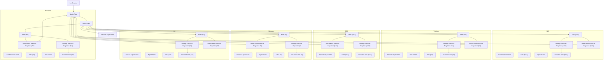

# Atmospherics

```mermaid
flowchart TD
ice_crusher[Ice Crusher]

wastePipeInbound[Waste Pipe]
wastePipeOutbound[Waste Pipe]
ice_crusher-->wastePipeOutbound
wastePipeOutbound-->wastePipeInbound
wastePipeInbound-->liquidDrainWaste["Passive Liquid Drain"]
subgraph Pol["Pollutants"]
    condensationValuePol["Condensation Valve"]
    powerControllerPol["APU (Pol)"]
    pipeHeaterCO2["Pipe Heater"]
    filterPol["Filter (Pol)"]
    storagePol["Insulated Tank (Pol)"]
    wasteRegulatorPol["Waste Back Pressure Regulator (Pol)"]
    storageRegulatorPol["Storage Pressure Regulator (Pol)"]
    wastePipeInbound-->filterPol
    filterPol-->storageRegulatorPol-->storagePol
    filterPol-->wasteRegulatorPol-->wastePipeOutbound
end
subgraph N2O["N2O"]
    condensationValueN2O["Condensation Valve"]
    powerControllerN2O["APU (N2O)"]
    pipeHeaterN2O["Pipe Heater"]
    filterN2O["Filter (N2O)"]
    storageN2O["Insulated Tank (N2O)"]
    storageRegulatorN2O["Storage Pressure Regulator (N2O)"]
    wasteRegulatorN2O["Waste Back Pressure Regulator (N2O)"]
    wastePipeInbound-->filterN2O
    filterN2O-->storageRegulatorN2O-->storageN2O
    filterN2O-->wasteRegulatorN2O-->wastePipeOutbound

end
subgraph Vol["Volatiles"]
    liquidDrainVol["Passive Liquid Drain"]
    pipeHeaterVol["Pipe Heater"]
    powerControllerVol["APU (Vol)"]
    filterVol["Filter (Vol)"]
    storageVol["Insulated Tank (Vol)"]
    storageRegulatorVol["Storage Pressure Regulator (Vol)"]
    wasteRegulatorVol["Waste Back Pressure Regulator (Vol)"]
    wastePipeInbound-->filterVol
    filterVol-->storageRegulatorVol-->storageVol
    filterVol-->wasteRegulatorVol-->wastePipeOutbound
end
subgraph CO2["CO2"]
    liquidDrainCO2["Passive Liquid Drain"]
    pipeHeaterCO2["Pipe Heater"]
    powerControllerCO2["APU (CO2)"]
    filterCO2["Filter (CO2)"]
    storageCO2["Insulated Tank (CO2)"]
    wasteRegulatorCO2["Waste Back Pressure Regulator (CO2)"]
    storageRegulatorCO2["Storage Pressure Regulator (CO2)"]
    wastePipeInbound-->filterCO2
    filterCO2-->wasteRegulatorCO2-->wastePipeOutbound
    filterCO2-->storageRegulatorCO2-->storageCO2
end
subgraph N["Nitrogen"]
    liquidDrainNitrogen["Passive Liquid Drain"]
    pipeHeaterNitrogen["Pipe Heater"]
    powerControllerNitrogen["APU (N)"]
    filterNitrogen["Filter (N)"]
    wasteRegulatorNitrogen["Waste Back Pressure Regulator (N)"]
    storageNitrogen["Insulated Tank (N)"]
    storageRegulatorNitrogen["Storage Pressure Regulator (N)"]
    wastePipeInbound-->filterNitrogen
    filterNitrogen-->storageRegulatorNitrogen-->storageNitrogen
    filterNitrogen-->wasteRegulatorNitrogen-->wastePipeOutbound
end
subgraph O2["O2"]
    liquidDrainO2["Passive Liquid Drain"]
    pipeHeaterO2["Pipe Heater"]
    powerControllerO2["APU (O2)"]
    filterOxygen["Filter (O2)"]
    storageOxygen["Insulated Tank (O2)"]
    storageRegulatorOxygen["Storage Pressure Regulator (O2)"]
    wasteRegulatorOxygen["Waste Back Pressure Regulator (O2)"]
    wastePipeInbound-->filterOxygen
    filterOxygen-->storageRegulatorOxygen-->storageOxygen
    filterOxygen-->wasteRegulatorOxygen-->wastePipeOutbound
end


```

<!-- 
pipe2[Pipe Segment]
pipe4[Pipe Segment]
pipe5[Pipe Segment]
door2[Outer Door]
subgraph InnerDoor [Inner Door]
  pipe1[Pipe Segment]
  pipe3[Pipe Segment]
end -->
