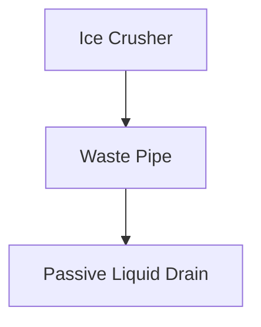
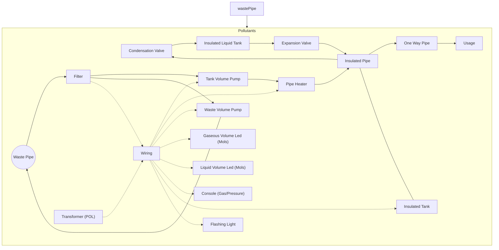
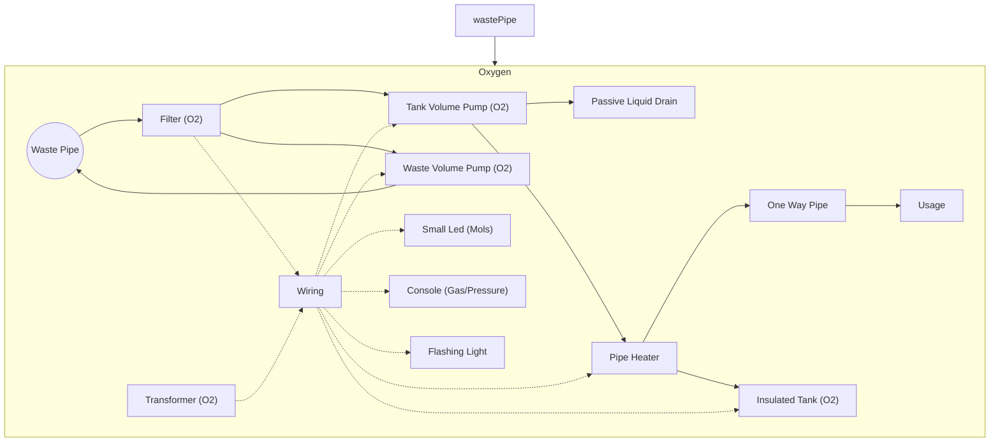

# Atmospherics
There are 2 types of atmospherics platforms I have designed.  One for gaseous elements that turn to Fluids at 27 degrees, high pressure,  and One for ones that stay Gas at high pressure.   N20, Pollutants, Water should use the Fluid builds.  Nitrogen, Oxygen, Volatiles, Carbon Dioxide can use the gas build.  

## Basic Design
The basic design has one waste pipe that all the filters feed off of.  It uses a set of IC chips to turn the filter and accompanying pumps to inactive/off if there is no air of the filterable type.  There is a set of Ice Crusher, Gas Canister Storage and Portable Container Storage that will feed the waste pipe.  It will also have one way pipes with a pump into it from other systems.





## Gaseous Element Filter
Build a 1 by 6 Frame section. Surround the first 5 frames with a 2 story building.  The Front and Back of the building are in another section. L: Liquid Storage S: Storage Tank, P: Piping, F: Filtration unit, W: Waste Pipe, Input on ground and Gas Output On Ceiling, C: Control Wall, [#]: Walkway you have already built connected to main building
```
[L]|[S] [P] [F] [W] [C]|[#] [#]
```
*Ingots: 32 Iron, 74 Copper, 16 Gold, 71 Silicon, 77 Steel, 5 Electrum, 5 Solder*
* 6X Steel Frames *(2g Steel each)*
  * 12X Steel Sheets *(0.5 Steel each)*
* 7X Composite Walls *(1g Steel)*
  * 14X Plastic Sheets *(0.5g Silicon Ingot)*
* Spray Paint *(1g Iron)*

* 40X Insulated Pipes *(1g Silicon, 1g Steel)*
* Kit (Tank Insulated) *(5 Copper, Silicon 30, Steel 20)*
* Kit (Atmospherics) *(10g Iron, 20g Copper, 5g Gold)*
  * 2X Kit (Pipe) *(1 Iron)*
  * 2X Coil *(1 Copper)*
* 2X Kit (Volume Pump) *(5g Iron, 3g Copper, 2g Gold)*
* Kit(Liquid Drain) *(5g Iron, 2g Copper)*
* Pipe Heater *(3g Copper, 3g Gold, 2g Steel)*

* IC10 Chip *(10 Gold, 4 Steel, 5 Electrum, 2 Solder)*
* 2X Console *(2g Iron, 5g Copper, 3g Gold)*
  * 2X Glass Sheet *(2 Silicon)*
  * Circuit Board (Gas Display) *(	1g Iron, 5g Copper, 5g Gold)*
* Kit (Transformer) *(10x Iron, 1x Gold , 3x Copper)*
* Kit (Flashing Light) *(1g Iron, 2g Copper, 1g Silicon)*
* 50X Coil *(25 Copper)*