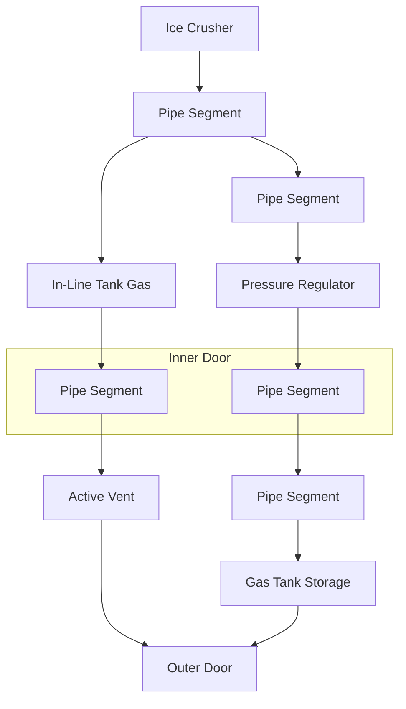

# Getting Power and Refill Oxygen
Build a building that has 4 floor tiles 1 door tile and 2 decks.  With walls and a ceiling made of Iron Frames.
Place the Lathe in the corner opposite the door, The APC in the Door and the Arc Furnace on the deck.  Put your Solar Panel on the roof.  Construct the lathe.  Then start producing list of items.  
You will need 4 Iron sheets than you can move all your resources to the PipeBender after its constructed.  Build your list of things in the PipeBender and then build the Ice Crusher far enough from the door that you can power it but not so far your power cables wont reach.  You will find you have to keep moving cables until the electric bench is made.
Your goal is to get the tank and the pressure regulator so you can fill your oxygen.  You will need to place your nitrogen filter so you don't suffocate.  You can use the active vent and door to turn you little room into a air lock to eat, drink and refresh hygiene.  A: Autolathe, P: Pipe Bender, ALG: Airlock & Gas Canister, F:Furnace, #:Floor, |#| Full Frame as wall

```
[ ]   |#|   |#|   [ ]
|#|    A     P    |#|
|#|    #     C    |#|
[ ]   |#|   ALG   |#|
[ ]    #     #    [ ]
[ ]    #     F    [ ]
```
*Mine: 78 Iron, 4 Gold, 25 Copper, 2 Silica, 100 Ice (Oxite)*
* Door *(7 Iron, 3 Copper)*
  * 1X Iron Sheet *(1 Iron)*
* Hydraulic Pipe Bender - *(20 Iron, 2 Gold, 10 Copper)*
  * 2X Iron Sheets *(2 Iron)*
  * 4X Copper Coils *(2 Copper)*
  * 2X Plastic Sheets *(2 Silica)*
* Nitrogen Filter *(5 Iron)*
* 9X pipes *(0.5 Iron Each, (3 Iron))*
* 3X Kit(Pipe Utility Gas) *(5 Iron)*
* Gas Canister (5 Iron)*
* Ice Crusher *(3 Iron, 1 Gold, 1 Copper)*
  * 1X Iron Sheets *(1 Iron)* 
  * 2X Cable Coils *(0.5 Copper)*
* Pressure Regulator *(5 Iron, 1 Gold, 2 Copper)*


