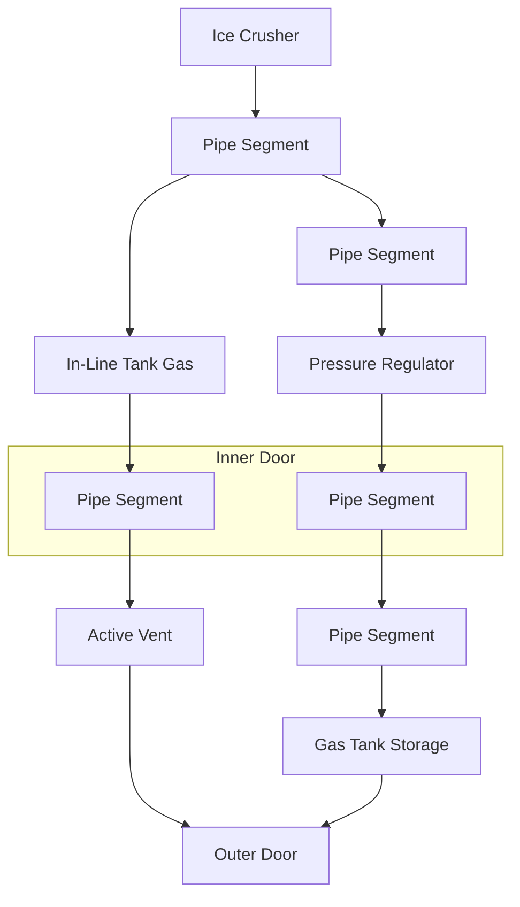

# stationeers

## Brutal start

### Getting Power and Refill Oxygen
Build a building that has 4 floor tiles 1 door tile and 2 decks.  With walls and a ceiling.
Place the Lathe in the corner opposite the door, The APC in the Door and the Arc Furnace on the deck.  Put your Solar Panel on the roof.  Construct the lathe.  Then start producing list of items.  
You will need 4 Iron sheets than you can move all your resources to the PipeBender after its constructed.  Build your list of things in the PipeBender and then build the Ice Crusher far enough from the door that you can power it but not so far your power cables wont reach.  You will find you have to keep moving cables until the electric bench is made.
Your goal is to get the tank and the pressure regulator so you can fill your oxygen.  You will need to place your nitrogen filter so you don't suffocate.  You can use the active vent and door to turn you little room into a air lock to eat, drink and refresh hygiene.  A: Autolathe, P: Pipe Bender, ALG: Airlock & Gas Canister, F:Furnace, #:Floor, |#| Full Frame as wall
```
[ ]   |#|   |#|   [ ]
|#|    A     P    |#|
|#|    #     C    |#|
[ ]   |#|   ALG   |#|
[ ]    #     #    [ ]
[ ]    #     F    [ ]
```
*Mine: 78 Iron, 4 Gold, 25 Copper, 2 Silica, 100 Ice (Oxite)*
* Door *(7 Iron, 3 Copper)*
  * 1X Iron Sheet *(1 Iron)*
* Hydraulic Pipe Bender - *(20 Iron, 2 Gold, 10 Copper)*
  * 2 Iron Sheets *(2 Iron)*
  * 4 Copper Coils *(2 Copper)*
  * 2 Plastic Sheets *(2 Silica)*
* Nitrogen Filter *(5 Iron)*
* 9X pipes *(0.5 Iron Each, (3 Iron))*
* 3X Kit(Pipe Utility Gas) *(5 Iron each (15 Iron))*
* Gas Canister (5 Iron)*
* Ice Crusher *(3 Iron, 1 Gold, 1 Copper)*
  * 1 Iron Sheets *(1 Iron)* 
  * 2 Cable Coils *(0.5 Copper)*
* Pressure Regulator *(5 Iron, 1 Gold, 2 Copper)*



### Furnace
Okay its time to start working your way up the tech tree.  First expand your deck and build your furnace on it.  Use the pipes to turn down then sideways,  put a one way valve turn away from you and shoot off.  Put the 3rd Iron Frame as a mount point for the passive vent.  At this point you can disassemble the arc furnace. A: Autolathe, P: Pipe Bender, ALG: Airlock & Gas Canister, F:Furnace, #:Floor
```
[ ]   |#|   |#|   [ ]
|#|    A     P    |#|
|#|    E     C    |#|
[ ]   |#|   ALG   |#|
[ ]    #     #    [ ]
[ ]    #     F    [ ]
[ ]   [ ]   [ ]   [ ]
[ ]   [ ]    V    [ ]   
```
*Mine: 52g Iron, 12g Copper*
* Furnace *(30g Iron, 10g Copper)*
    * 4X Iron Sheets *(1g Iron each, (4 Iron))*
* 3X Iron Frames *(4g Iron each, (12 Iron))*
    * 3X Iron Sheets *(1g Iron each, (3 Iron))*
* Kit (Pipe Valve) *(3g Iron,
2g Copper)*
* 6X Pipe *(0.5 Iron Each, (1 Iron))*
* Passive Vent *(3g Iron)*

### Getting electronics
Now that your power and air are stable.  Its time to start working on electronics.  With the electronics need solved you can print enough cables that you can turn things on without moving the cables.  

*Mine: 54 Iron, 2 Gold, 12 Copper, 4 Silica*
* Electronics Printer *(20g Iron, 2g Gold, 10g Copper)* 
    * 2X Iron Sheets *(1g Iron each, (2 Iron))*
    * 4X Cable Coil *(0.5 Copper each (2 Copper))*
    * 2X Plastic Sheets *(1g Silica each, (2 Silica))*


### Upgrade Base
Its time to stop squatting in the dark, and throwing your stuff on the floor!
We are going to take our 8 tile iron base, double its size and convert it to Steel and Composites.  Empty your base of air and replace all the floor markers with Closed Steel Frames.  Then you can build the rest of the structure Around the frames and working base.  
**Before**
```
[ ]   |#|   |#|   [ ]
|#|    A     P    |#|
|#|    #     C    |#|
[ ]   |#|   ALG   |#|
[ ]    #     #    [ ]
[ ]    #     F    [ ]
[ ]   [ ]   [ ]   [ ]
[ ]   [ ]    V    [ ]     
```

**After**
Composite Walls are now denoted by --- or |.  A: Autolathe, T: Tool Manufacture, E: Electronics Printer, P: Pipe Bender, I: Ice Machine& Water Bottle Filer, G: Gas Canister, B: Station Battery, S: Storage, G:Garden, K: Kitchen, F:Furnace, #:Floor, AC:Air Condition, R:Radiator, [ ]: Empty
```
[ ] ---   ---   ---   --- 
[ ]| G     T     S     E |
[ ]| G     P     #     A |
[ ]| S     #     #     S |
[ ]| K     S     #     I |
                -D-   ---       
 R | AC    B   | AL    G | 
    ---   ---   -D-   --- 
[ ]  #     #     #     # 
[ ]  #     #     F     # 
```
*Mine: 123 Iron, 41 Coal, 50g Copper, 25g Gold, 104g Silicon*

*Ingots: 162 Steel, 50 Copper, 25 Gold, 72 Silicon*
* 29X Steel Frames *(2g Steel each)*
  * 58X Steel Sheets *(	0.5 Steel each)*
* 59X Composite Wall *(1g Steel)*
  * 118X Plastic Sheets	*(0.5g Silicon Ingot)*
* 50X Heavy Coil *(25 Copper, 25 Gold)*
* 50X Coil *(25 Copper)
* 20X Insulated Pipes *(1g Silicon, 1g Steel)*
* 20X Insulated Liquid Pipes *(1g Silicon, 1g Steel)*

### Bottle Filler
By now you are probably just about out of water.  Time to refill those bottles.  If your going to run your pipes in your walls they need to be insulated, add silicon.  
*Mine: Water Ice, 15 Iron, 6 Copper, 16 Silicon*
* Water Bottle Filler *(5g Iron Ingot, 3g Copper Ingot, 8g Silicon Ingot)*
* Drinking Fountain *(5g Iron 3g Copper 8g Silicon)
* 10X Kit (Liquid Pipe) *(0.5g Iron)

### Tool Manufactory
Before your big mining trip lets get some bags.  Put this outside... There is no more room in your base.

*Mine: 28 Iron, 12 Copper, 2 Silica*
* Tool Manufactory *(20g Iron, 10g Copper)*
    * 2X Iron Sheets *(1g Iron each, (2 Iron))*
    * 4X Cable Coil *(0.5 Copper each (2 Copper))*
    * 2X Plastic Sheets *(1g Silica each, (2 Silica))*
* 2X Mining Backpack *(6g Iron)*

### Airlock & a fully pressurized base.
Time to upgrade your airlock and keep your base pressurized.  You will be replacing your manual door with an composite door.  I recommend keeping the Pipe Canister with Multiple MPa of Breathable air on the inside of your airlock instead of venting to your base.  It makes the airlock MUCH faster.  !!!WARNING!!! Your base temperature is NOT controlled.  You must manually monitor it, the pieces for Manually operated temperature radiator are in the Starter Green Corner section.
*Ingots: 88 Iron, 41 Copper, 23 Gold, 9 Silicon, 9 Steel, 3(100) Solder(Make Solder in batches of 100)*
*Mine: 84 Iron, 41 Copper, 23 Gold, 9 Silicon, 2 Coal, 50 Lead*
* Door *(7 Iron, 3 Copper)*
  * 2X Plastic Sheet *(1 Silicon Each )*
  * 2X Glass Sheet *(1 Silicon Each )*
* Power Controller *(5g Iron, 2g Copper, 3g Solder)*
* Battery Cell (Large) *(10g Copper, 5g Gold, 5g Steel)*
* Circuitboard (Advanced Airlock)/(Airlock) [Pick One based on the planetary object selected.] *( 1g Iron, 5g Copper, 5g Gold)*
* Console *(2g Iron, 5g Copper, 3g Gold)*
  * Glass Sheet *(2 Silicon)*
* Gas Sensor *(3g Iron, 1g Copper, 1g Gold)*
* Flashing Light *(1g Iron, 2g Copper, 1g Silicon)*
* Data Disk *(5g Copper, 5g Gold)*   [!!!WARNING DON'T PRINT 2 of these!!!]
* 2X Active Vent *(5g Iron, 5g Copper, 1g Gold)* (You already have 1 Active Vent)
* 2X Passive Vent *(3g Iron)* OR 1X Passive Vent & 2X Kit(Pipe Utility Gas) (You already have the Utility Gas setup.)
* 4X Insulated Pipes Pipe *(1g Silicon, 1g Steel each)*

### Starter Green Corner
You need food!  Time for the Starter Green Corner.   This gives you a few plants in your main base...  You will have to manually monitor temp and pressure or you will KILL your plants.  This includes a set of vents, pipes and radiators to let you remove heat.  You need to get the temp to 25+/-5 Degrees and the pressure to 75+/-25kPa.  If you need to warm up, use the valve and radiator thru the base from your furnace.  DON'T VENT use the radiator.  But you will have to be careful
*Ingot: 76 Iron, 17 Copper, 7 Gold, 23 Silica,35 Steel,10 Electrum(Make in a batch of 100), 200 Ice(Oxite), 100 Ice(Water)*
*Mine: 100 Iron, 17 Copper, 58 Gold, 23 Silica, 10 Coal,50 Silver*
* Grow Light *(5g Copper, 5g Steel, 10g Electrum)*
* 4X Kit (Hydroponic Tray) *(10 Iron each)*
* 15X Insulated Liquid Pipes *(1g Silicon, 1g Steel)*
* Powered Bench *(20g Iron, 5g Copper)*
* Microwave *(5g Iron, 1g Gold, 2g Copper, 3g Steel)*
* Active Vent *(5g Iron, 1g Gold, 5g Copper)*
* Passive Vent *(3g Iron)*
* 8X Insulated Pipes *(1g Silicon, 1g Steel)*
* 2X Kit (Radiator) *(3g Gold, 2g Steel)*
* Kit (Pipe Valve) *(3g Iron, 2g Copper)*


### Automate Power
In order to start automating power you need a variety of ores.  Make sure you get the big 3 Iron, Copper and Gold. And trace elements of Lead, Silver, Coal. Spend a long mining trip.  

[Here](Generator-SolarControl.ic10) is a link to the Solar Panel control script.  It assumes you put your daylight sensor between your solar panels with its plug on the same line as the data line.

*Mine: 49g Iron, 121g Copper, 76g Gold, 4g Silver, 4g Lead, 11g Coal*
*Ingot: 8 Iron, 116 Copper, 76 Gold, 43 Steel, 5 Electrum, 4 Solder*
* IC10 Chip *(10 Gold, 4 Steel, 5 Electrum, 2 Solder)*
* IC Housing *(10 Copper, 4 Steel, 2 Solder)*
* Computer *(5g Iron, 5g Gold, 10g Copper)*
* Motherboard (IC Editor) *(5g Copper, 5g Gold)*
* Daylight Sensor *(3g Iron, 1g Gold, 1g Copper)*
* 2X Solar Panel *(	5g Gold, 20g Copper, 15g Steel)*
* Kit (Battery) *(	20g Gold, 20g Copper, 20g Steel)*
* 50X Heavy Coil *(25 Copper, 25 Gold)*
* 50X Coil *(25 Copper)

## Midgame transition.  You SURVIVED the Brutal start!
I recommend building a new base at this point.  Your starter base is too cramped and you have to tear it down anyway.  Your missing key functionality like atmosphere temperature control, atmostphere filtering, the advanced workbenches and advanced furnace, storage.  Aren't you tired of throwing things in the corner?

### Advanced Furnace

### Basic AC & Filtering


### Starter Greenhouse
You need food!  Time for the starter Greenhouse.  This is a semi self contained building.  Its starter air supply and water supply will be piped from Core Base or Life Support once its up and running.  
#### Prep (Optional)
You might want to make it easier to build by putting everything in Crates for each section of the build.  A few container mounts will protect your containers during a storm.

#### The building
This is a 3 by 5 building, two stories tall, with an airlock.  The I is the input for water and air.
*Mine:  Steel(66 Iron, 22 Coal), 47 Silicon, 26 Iron, 6 Copper
```
  ---    ---  -g-  -g-
| Batt | Strg Grow Grow | Radiator
  ---                     ---
D AirL D Path Path Path   AC  |
| AirL | Kitn Grow Grow   H2O |
  ---    ---  -g-  -g-    -I-
```
* 15X Steel Frames *(2g Steel each)*
  * 15X 2X Steel Sheets *(	0.5 Steel each)*
* 38X Composite Wall *(1g Steel)*
  * 38X Plastic Sheets	*(0.5g Silicon Ingot)*
* 12X Composite Window *(1g Steel)*
  * 12X Plastic Sheets	*(0.5g Silicon Ingot)*
  * 12X Glass Sheets	*(2g Silicon Ingot)*
* 2X Door *(7 Iron, 3 Copper)*
  * 2X Plastic Sheet *(0.5 Silicon Each )*
  * 2X Glass Sheet *(1 Silicon Each )*
* Power Controller *(5g Iron, 2g Copper, 3g Solder)*
* Battery Cell (Large) *(5g Gold, 10g Copper, 5g Steel)*
Optional Interior and Floor
* 26X Composite Wall *(1g Steel)*
  * 26X Plastic Sheets	*(0.5g Silicon Ingot)*
* 12X Composite Window *(1g Steel)*
  * 12X Plastic Sheets	*(0.5g Silicon Ingot)*
  * Why put glass on the inside?  We just want to make it look good.
* 13X Floor Grating *(	1g Iron)*


### Time to build your kitchen

### Time to expand your power

### Time to build the Life Support room.  Ahhh Airconditioning and pure oxygen!

### Advanced furnace time

### Time to upgrade those benches and tools!


### Double your living space
**Before**
```
Empty   Wall    Wall    Empty
Wall    Floor   Floor   Wall
Wall    Floor   Floor   Wall
Wall    Door    Wall    Empty
Empty   Deck    Deck    Empty
```
**After**
```
Empty    -I-     -I-    Empty
Empty | Floor   Floor | Empty
Empty | Floor   Floor | Empty
Frame   Floor   Floor   Frame
Frame   Floor   Floor   Frame
Frame   Door    Frame   Empty
Empty   Deck    Deck    Empty
Empty   Furn    Deck    Empty
```
* 2X Iron Frames *(4g Iron each, (8 Iron))*
    * 4X Iron Sheets *(1g Iron each, (4 Iron))*
* 10X Iron Walls *(1g Iron each, (10 Iron))*
    * 10X Iron Sheets *(1g Iron each, (10 Iron))*
